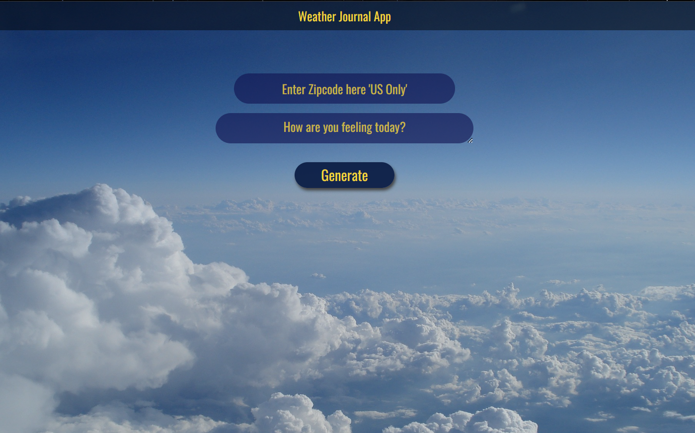
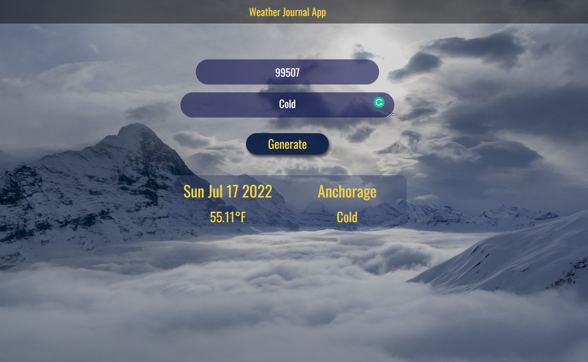
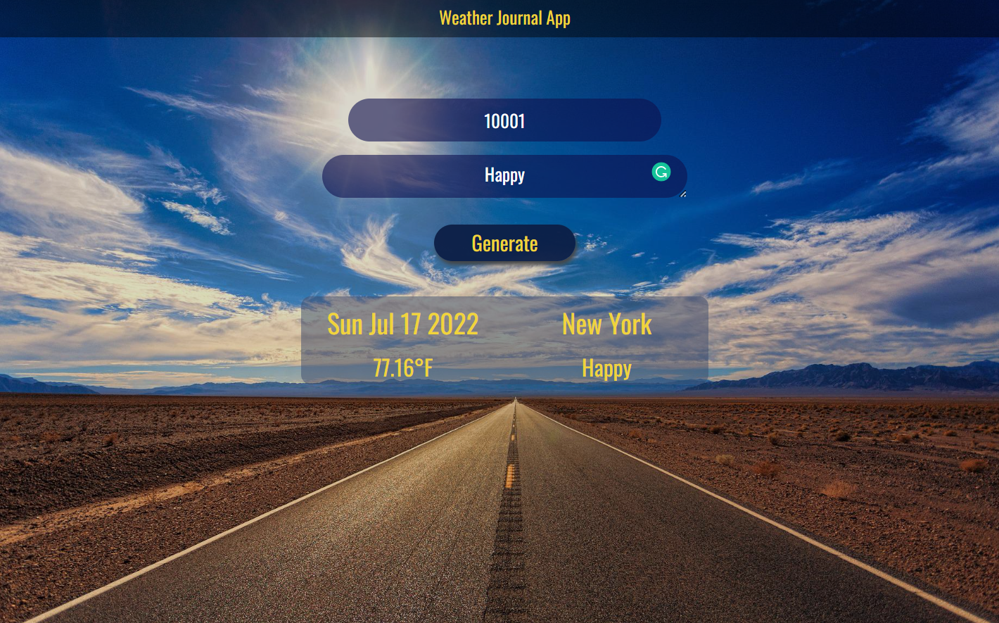

# Weather-Journal App Project

##### Weather Journal App (Front End Developer Udacity Nanodegree)

###### _My Second Project_

## Overview

This project requires you to create an asynchronous web app that uses Web API and user data to dynamically update the UI.

## Setup and Run

1. Project's environment, make sure that the Node and packages (express, cors and body-parser) using the terminal prompt `npm i 'packageName'`

2. prompt in terminal command line `node server.js`
3. This application works on http://localhost:3000/
4. You are allowed to choose any ZipCode in **US** Only

## Features

1.  The application Dynamically output data (City, Temperature and Date ) based on the input ZipCode

2.  Smoothly SlideDown the Output.

3.  Automatically Switch the Background Cover based on the Temperature.
    - Examples for testing:
      - New York ZipCode: 10001, 10002, ... , 11201 _(**Worm**)_
      - Alaska ZipCode: 99507, 99508 _(**Cold**)_

## Results

#### home Page

#### Cold Weather

#### Worm Weather

## Acknowledgement

- [Udacity - Professional track](https://www.udacity.com "Udacity").
- [MDN](https://developer.mozilla.org/en-US/ "Mozilla Developer Network")
- [Stack Overflow](https://stackoverflow.com/ "Stack Overflow")
- [Pixabay - free images](https://pixabay.com/)

### License & Copyright

© Udacity - Shehabeldin Alhawary
